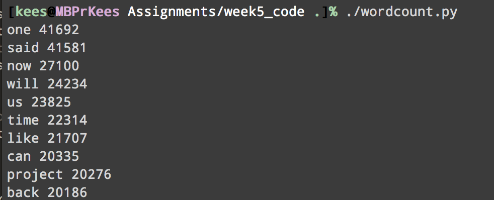

## Activity 2.1


## Activity 2.2
The code can be found in `gcd-week5/wordcount.py`.



## Activity 2.3
There are multiple ways to do this.

It is possible to do this with a native shell command, named `time`.
I executed a couple of times `time ./gcd-week5/wordcount.py` and this resulted in:

```
./wordcount.py  13,94s user 0,32s system 99% cpu 14,327 total
./wordcount.py  13,85s user 0,32s system 99% cpu 14,269 total
./wordcount.py  13,95s user 0,31s system 99% cpu 14,317 total
```
The other way is with Python itself, using the `timeit` module.
